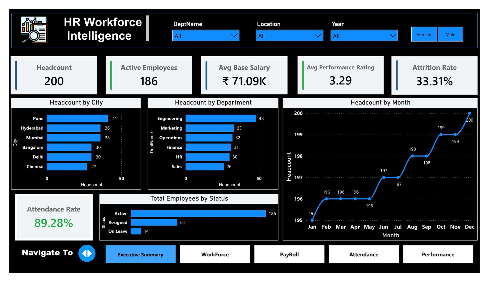
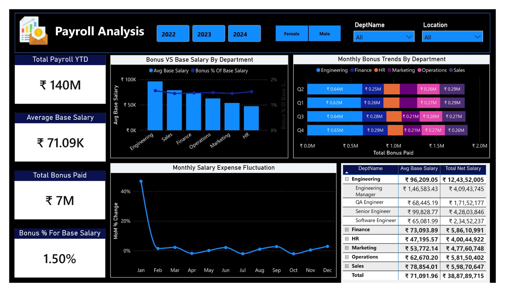
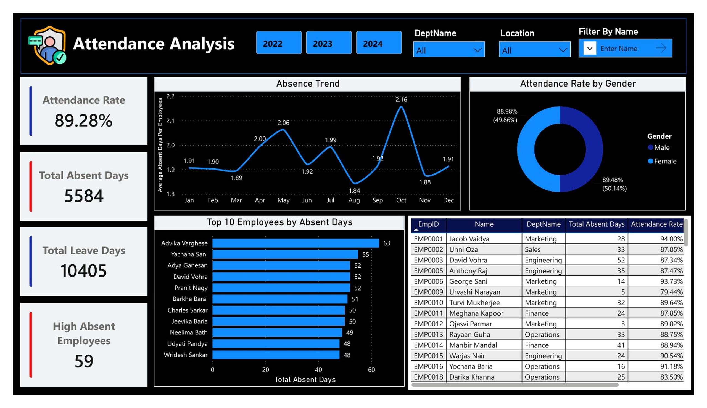
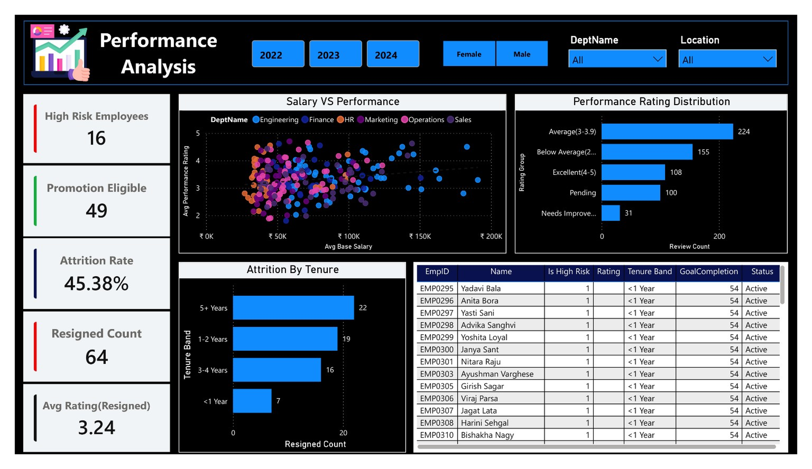

# HR Intelligence Power BI Dashboard

An interactive **HR Intelligence Dashboard** built using **Microsoft Power BI** to analyze workforce data and provide meaningful insights into employee performance, payroll, attendance, and workforce trends.

## 📊 Project Overview

This project focuses on transforming raw HR data into an interactive and insightful Power BI dashboard.

The project includes:

- Data Cleaning and Transformation
- Data Modeling
- DAX Calculations
- KPI Development
- Interactive Dashboard Design
- HR Analytics and Visualization

## 🛠️ Tools & Technologies

- **Power BI**
- **Power Query**
- **DAX**
- **Data Modeling**
- **Excel**
- **Data Visualization**

## 📑 Dashboard Pages

### 1. Executive Summary
Provides a high-level overview of important HR KPIs and workforce metrics.

### 2. Workforce Overview
Analyzes employee distribution, workforce composition, departments, job roles, and employee trends.

### 3. Payroll Analysis
Provides insights into salary distribution, payroll costs, and compensation patterns.

### 4. Attendance Analysis
Analyzes employee attendance and related workforce patterns.

### 5. Performance Analysis
Provides insights into employee performance and helps identify performance trends.

## 📸 Dashboard Preview

### Executive Summary


### Workforce Overview


### Payroll Analysis


### Attendance Analysis


### Performance Analysis


## 📁 Repository Structure

```text
HR-Intelligence-Power-BI/
│
├── Dashboards/
│   ├── 01_Executive_Summary.png
│   ├── 02_Workforce_Overview.png
│   ├── 03_Payroll_Analysis.png
│   ├── 04_Attendance_Analysis.png
│   └── 05_Performance_Analysis.png
│
├── HR Intelligence.pbix
│
└── README.md
